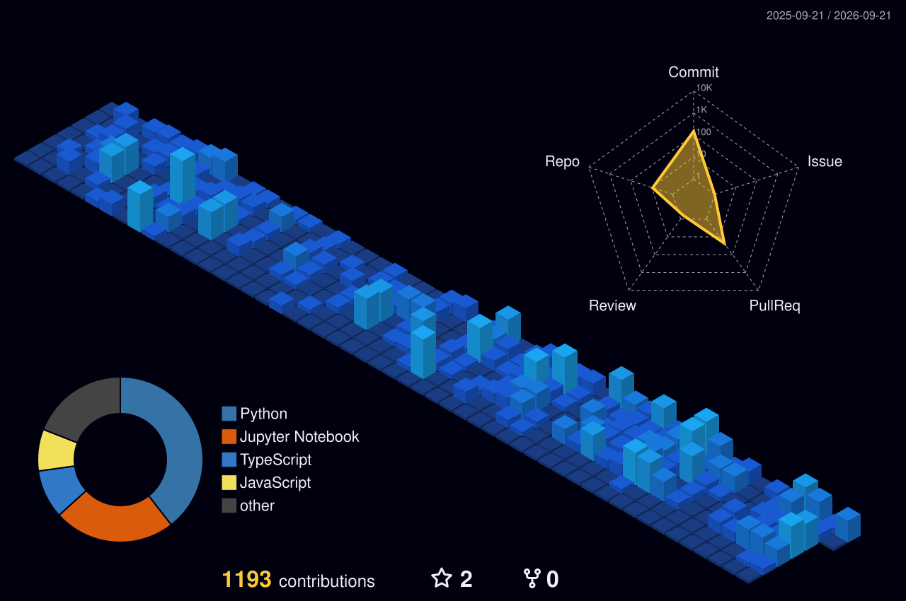

 

  

---

### 👨‍💻 Who am I?
I'm Ziad. I spend half my time engineering high-throughput backend infrastructure, agentic workflows, mathematical modelling, building models from scratch with math, and the other half tracking my macros, lifting, swimming, playing football, climbing, and playing piano. I recently graduated from **KFUPM** with First Honors and spent an exchange semester at **KAIST** (where I survived building an OS in Pintos and joined the Kumdo club). 

Instead of just hooking up API wrappers, I like understanding how systems break and how to make them resilient - from an RL - trained Doom agent to autonomous fintech pipelines processing millions. 

### ⚡ What I'm up to
- 🏗️ **Building:** Scalable backend architecture and internal agentic knowledge platforms at **Stream** (and other tasks too).
- 🧠 **Exploring:** Quantitative Finance and Algos, Time Series, multimodal models quantization and fine-tuning, temporal learning, and hardware-software co-design.
- 🏋️‍♂️ **AFK:** Healthy stuff, watching travel vlogs, or travelling.

### 🛠️ The Arsenal

  <a href="https://skillicons.dev">
    
     
    
  </a>

### 📈 Deep Dive Analytics

  

### 🏆 Achievements & Streaks

  

### 🏙️ 3D Contribution City

  

### 🐍 Contribution Graph

  <picture>
    <source media="(prefers-color-scheme: dark)" srcset="https://raw.githubusercontent.com/ziad-alalami/ziad-alalami/output/github-contribution-grid-snake-dark.svg">
    <source media="(prefers-color-scheme: light)" srcset="https://raw.githubusercontent.com/ziad-alalami/ziad-alalami/output/github-contribution-grid-snake.svg">
    
  </picture>

  📫 <b>Reach me:</b> <a href="mailto:ziadalalami@gmail.com">ziadalalami@gmail.com</a>

